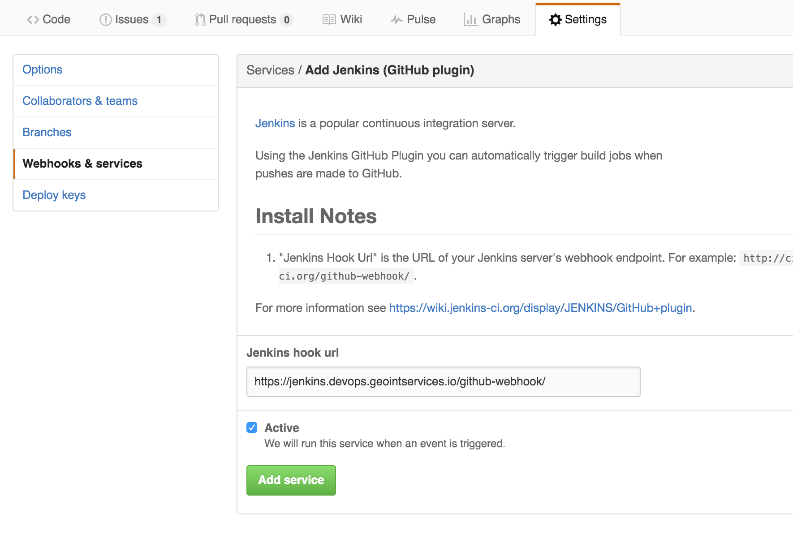

# Piazza Devops

* [Credentials](#credentials)
* [Cloud Foundry (The Platform)](#cloud-foundry)
  - [Local Development](#local-development)
  - [Services](#services)
* [Jenkins (Automation)](#jenkins)
  - [Special Features](#special-sauce)
  - [Migrating](#migrating)
* [Nexus (Artifact Repository)](#nexus)
* [Backing Services](#backing-services)
* [Roadmap](#roadmap)

## Credentials

* You'll need to setup an LDAP account with [GEOINT Services](https://accounts.geointservices.io/).
* Make sure you can access [our Jenkins organization](https://jenkins.devops.geointservices.io/job/piazza/).

## Cloud Foundry

### Local Development
* [Install](https://github.com/cloudfoundry/cli#downloads) the `cf` CLI client.
* Login to PCF:

  ```
    cf login -a https://api.devops.geointservices.io
    # Note: email = your LDAP username
    cf target -o piazza -s simulator-dev
  ```

* The `simulator-dev` space is the sandbox environment for piazza devs.
* `simulator-stage` is the space jenkins will use to stage apps.
* Useful commands:

  ```
    cf apps                      # list all apps
    cf app pz-logger             # individual app info
    cf logs --recent pz-gateway  # show recent logs for an app
    cf logs pz-gateway           # tail and follow logs for an app
    cf services                  # view a list of running services
    cf push                      # push an app to Cloud Foundry
  ```
* And there is also a [Web UI](https://login.devops.geointservices.io/login).

### Services
* Bind a service to your app using the `manifest` to expose `VCAP_SERVICES`:

  ```
    applications:
      services:
        - pz-postgres
        - pz-blobstore
  ```

* Available services:
  - `pz-blobstore` - s3 bucket
  - `pz-discover` - legacy service discovery
  - `pz-geoserver`
  - `pz-kafka`
  - `pz-postgres`
  - `pz-zookeeper`
  - `pz-mongodb`
  - `pz-elasticsearch`
* Sample `VCAP_SERVICES` json:

  ```
    {
     "VCAP_SERVICES": {
      "user-provided": [
       {
        "credentials": {
         "bucket": "pz-blobstore-staging"
        },
        "label": "user-provided",
        "name": "pz-blobstore",
        "syslog_drain_url": "",
        "tags": []
       }
      ]
     }
    }
  ```

## Jenkins

* All jobs are generated and maintained using the [jenkins seed job](https://github.com/venicegeo/jenkins/tree/geoint).
* All jobs publish status to [slack](https://venicegeo.slack.com/messages/jenkins/).
* Connect your github repo to jenkins:
  - Go to github.com/venicegeo/<your-repository> and navigate to `Settings -> Webhooks & Services -> Services -> Add service -> Jenkins (GitHub plugin)`
  - Webhook URL: `https://jenkins.devops.geointservices.io/github-webhook/`

* Create automation scripts:
  - `./ci/` - holds any scripts you'd like jenkins to use in building, testing, and deploying your project.
    - `./ci/<job-name>.sh` corresponds to the `<job-name>` in your Jenkins pipeline.
* Add your repo to the [Jenkins Projects list](https://github.com/venicegeo/jenkins/blob/geoint/Projects.groovy):

    ```
    static projects = [
      [
       name: 'my-app',
       pipeline: ['test', 'archive', 'stage']
      ]
    ]
    ```
* All jobs will only build master by default, but you can specify branches useing the `branch` key in your project map:
  - `branch: '**'` will build all branches.

### Special Sauce
* Versioning - the automation pipeline follows a versioning convention that is coupled with the git revision (i.e. we're not aiming for human readability).
* `./ci/vars.sh` - projects should provide the automation with a file `./ci/vars.sh` that defines two variables `APP` and `EXT`:

  ```
    APP=pz-app
    EXT=jar
  ```

* `archive` - archive jobs automagically push your artifact to nexus.
  - Required: `./ci/archive.sh` needs to build your artifact and move it to `./$APP.$EXT`.
* `stage` - stage jobs automagically stage your app in Cloud Foundry.
  - Required: `manifest.jenkins.yml` - a manifest specific to Jenkins (and the staging environment).
* `blackbox` - make sure newman is available
* Static file projects - the automation will expect a `tar.gz` file to push to nexus; it is recommended to do something like: `./ci/archive.sh`:

  ```
    #!/bin/bash -ex

    pushd `dirname $0`/.. > /dev/null
    root=$(pwd -P)
    popd > /dev/null

    # APP=<my-project>
    # EXT=tar.gz
    source $root/ci/vars.sh
    tar -czf $APP.$EXT -C $root <directory-that-contains-the-static-files>
  ```

* Binary projects (I'm looking at you `golang`) - `EXT=bin` let's the automation know we're dealing with an executable.
* The seed job will organize your project's jobs into a folder:

* The seed job will create a pipeline view for you:


### Migrating

* Create new build scripts in `./ci`
  - We are storing scripts in `./ci` (not `./scripts`) to allow for both environments to function in parallel.
  - The functionality of `cf-deliver` can be accessed using the `stage` keyword.
  - Switch webooks to point to teh geoint jenkins.

## Nexus

* We are now storing build artifacts in [Nexus](https://nexus.devops.geointservices.io/#welcome).
* Accessing locally - configure maven:
  ```
    <?xml version="1.0"?>
    <settings>
      <servers>
        <server>
          <id>nexus</id>
          <username>YOUR_LDAP_USERNAME</username>
          <password>YOUR_LDAP_PASSWORD</password>
        </server>
      </servers>
    </settings>
  ```

## Backing Services

* Backing Services come from one of three possible locations:
  - AWS FADE: LDAP.
  - pz-infrastructure: our VPC.
  - PCF Marketplace: `cf marketplace`

## Roadmap

* Turn off old Cloud Foundry and Jenkins.
* `jenkins.yml`: control jenkins from your project's repository (no more editing the seed job).
* PCF Service Controller - dynamically provision resources from `pz-infrastructure`.
* Blue/Green deploys - I had to disable them for the new environment.
