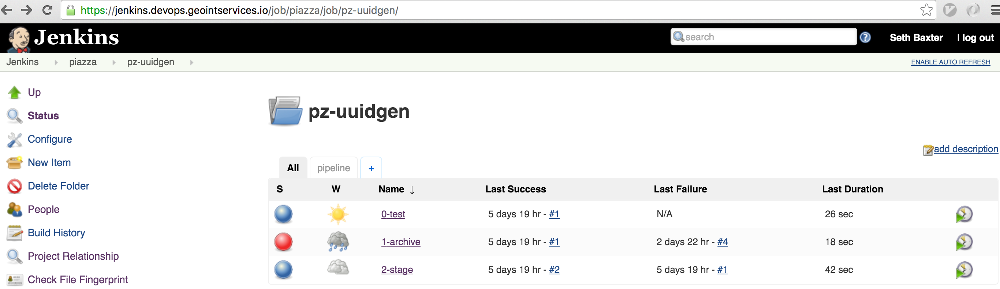
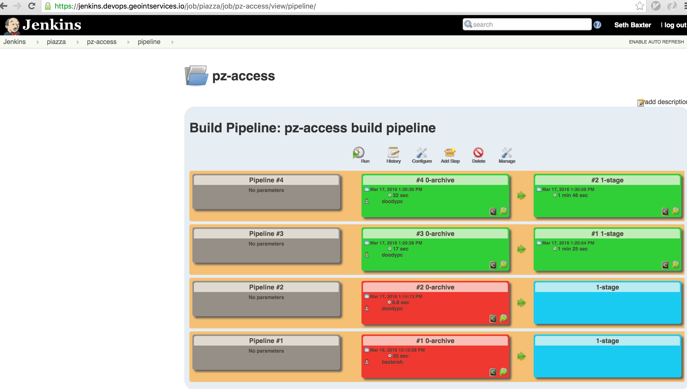

# VeniceGEO Devops

## Overview

### Infrastructure/Configuration in Code

#### Ephemeral
- Amazon physical resources (ec2 instances).
- These resources will come and go.
- *Should* only be created as a result of an automated process.

#### Runtime
- Application source code.
- AWS Cloudformation templates.
  - All resources defined in a single JSON file, within SCM.
  - Venice cloudformation templates: [canal](https://github.com/venicegeo/canal) _(private repo)_

#### Persistent
- Machine configuration.
- Baked into Amazon Machine Images (AMI) using Chef.
- Venice AMI build process: [gondola](https://github.com/venicegeo/gondola) _(private repo)_

### CI/CD

#### [Jenkins](http://jenkins.piazzageo.io)
- One script defines all build pipelines: [jenkins](https://github.com/venicegeo/jenkins)
- Testing and building artifacts; automated delivery to CloudFoundry.
  - Feedback published in [slack](https://venicegeo.slack.com).
  - Artifacts are currently being stored in s3, but we're move to Nexus soon.
  - build and testing tools baked into the jenkins machine image (via [gondola](https://github.com/venicegeo/gondola)).

#### [CloudFoundry](http://login.cf.piazzageo.io)
- Running Piazza services:
  - [pz-discover](https://github.com/venicegeo/pz-discover)
  - [pz-logger](https://github.com/venicegeo/pz-logger)
  - [pz-alerter](https://github.com/venicegeo/pz-alerter)
  - [pz-uuidgen](https://github.com/venicegeo/pz-uuidgen)
  - [pz-jobmanager](https://github.com/venicegeo/pz-jobmanager)
  - [pz-dispatcher](https://github.com/venicegeo/pz-jobmanager)
  - [pz-gateway](https://github.com/venicegeo/pz-gateway)
  - [pzsvc-gdaldem](https://github.com/venicegeo/pz-gdaldem)
  - [pzsvc-lasinfo](https://github.com/venicegeo/pz-lasinfo)

#### Shared Services
- _Note: these services are currently running in the larger AWS environment, but they are being migrated to CloudFoundry._
  - elasticsearch 
  - geoserver
  - kafka
  - mongodb
  - postgresql (with PostGIS)
  - zookeeper

- Not migrating to CloudFoundry, but available nonetheless:
  - BOSH
  - CloudFoundry
  - jenkins
  - swagger
